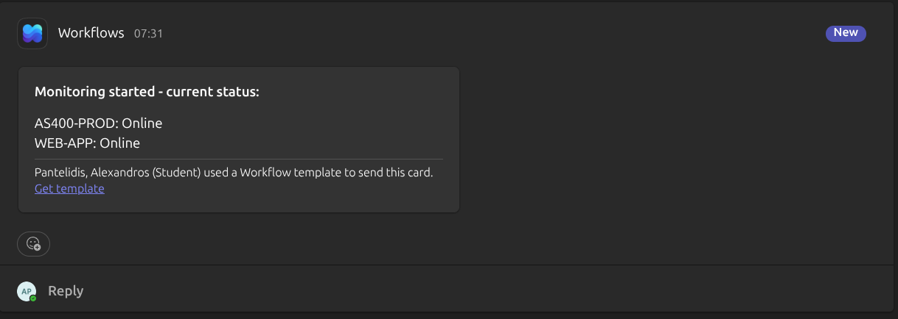
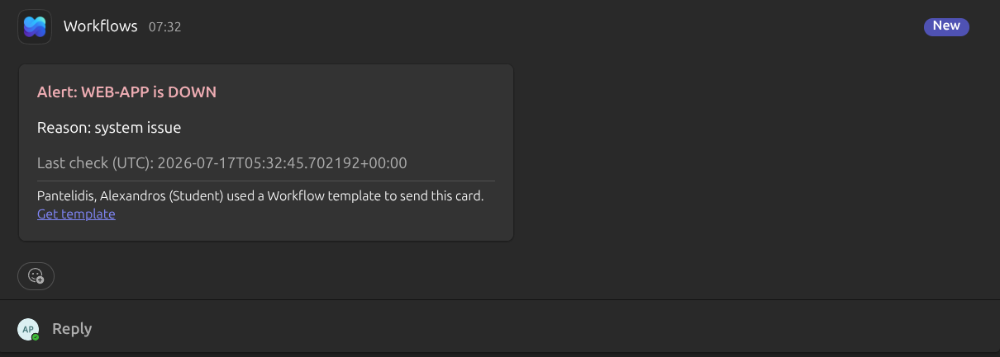
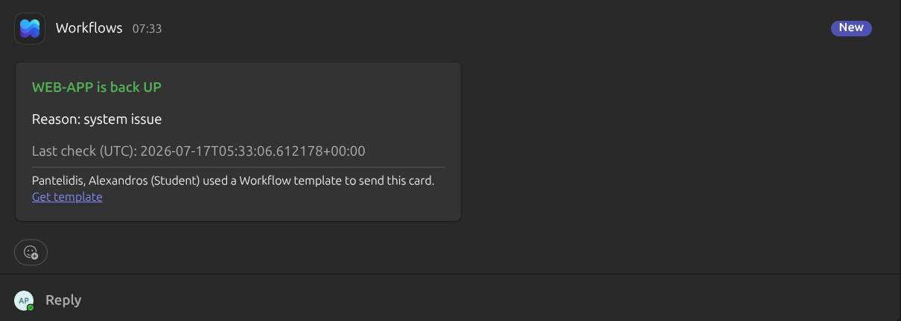
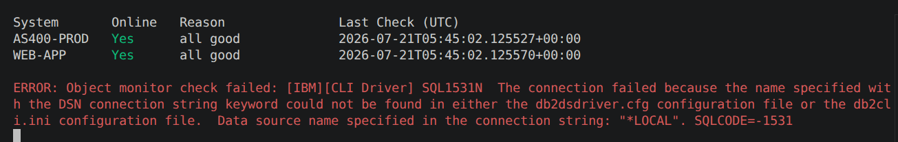

# ASAP — AS400 Status Alert Platform

ASAP monitors the status of in-house and external systems and alerts engineers via 
Microsoft Teams when a system goes up or down and also to monitor spesific jobs and send alerts on teams when their status changes. It's designed to run natively on IBM i (AS/400).

## Features:

- Polls system status APIs on a schedule
- Detects state changes (up ↔ down)
- Sends real-time alerts to Microsoft Teams
- Runs natively on IBM i / AS400

## Requirements:

`main.py --app` requires nothing beyond the **Python standard library** — no external packages needed, just Python 3.8 or higher — [download here](https://www.python.org/downloads/)

`main.py --jobs` requires `ibm_db` so it can query local IBM i Db2.

`demo_api.py` is included only for local testing (it simulates the status API so you can try the monitor without a real backend). It requires **Flask**:

```bash
pip install -r Requirements.txt
```

You won't need Flask (or `demo_api.py` at all) if you're running against a real API endpoint.

## Setup:

1. Clone the repo
2. Rename `.env.example` to `.env` and fill in your values:
   - `WEBHOOK_URL` — Teams Workflows webhook URL
   - `API_URL` — endpoint returning system status JSON
   - `DB2USER` / `DB2PWD` — IBM i Db2 credentials for `jobs.py`
   - `OBJECT_STATS_SQL` — SQL returning `OBJLIB`, `OBJNAME`, `OBJTYPE`, and `OBJTEXT`
3. 
   - Run both monitors with `python main.py` or `python3 main.py --app --jobs` with screen `python3 main.py --s`
   - Run system-status monitor `python3 main.py --app` with screen `python3 main.py --s --app`
   - Run jobs monitor `python3 main.py --jobs` with screen `python3 main.py --s --jobs`

## Running as a Batch Job on IBM i (`run.sh`)

A `run.sh` script is included so the monitor can be launched from the **QSH (Qshell)**
environment rather than **QP2TERM**. QP2TERM sessions are tied to an interactive job and
do not persist independently, so a process started there cannot be submitted as a
standalone batch job.

Launching via QSH instead allows the monitor to be submitted with `SBMJOB` as a proper
batch job, which can then be configured (e.g. via a startup program referenced in
`QSTRUPPGM`, or scheduled in the job scheduler) to start automatically whenever the
system is IPL'd or restarted. This is required because IBM i does not automatically
resume interactive terminal sessions after a restart — without this, the monitor would
need to be started manually every time.

## Setup with demo_api.py for local testing:

If you don't have a real status API to test against, you can use the included `demo_api.py` to simulate one.

1. Install Flask:
```bash
   pip install -r Requirements.txt
```
2. Run the demo API:
```bash
   python demo_api.py
```
3. In your `.env`, set `API_URL` to point to the demo API (e.g. `http://127.0.0.1:5000/demo/api/SystemStatus`)
4. In a separate terminal, run the monitor:
```bash
   python main.py --app
```

This lets you see the full alert flow (Teams messages, logs, screen output) without needing a real backend.

## Example alerts

**Monitoring started:**


**System down alert:**


**System back up alert:**


**System output in terminal:**

